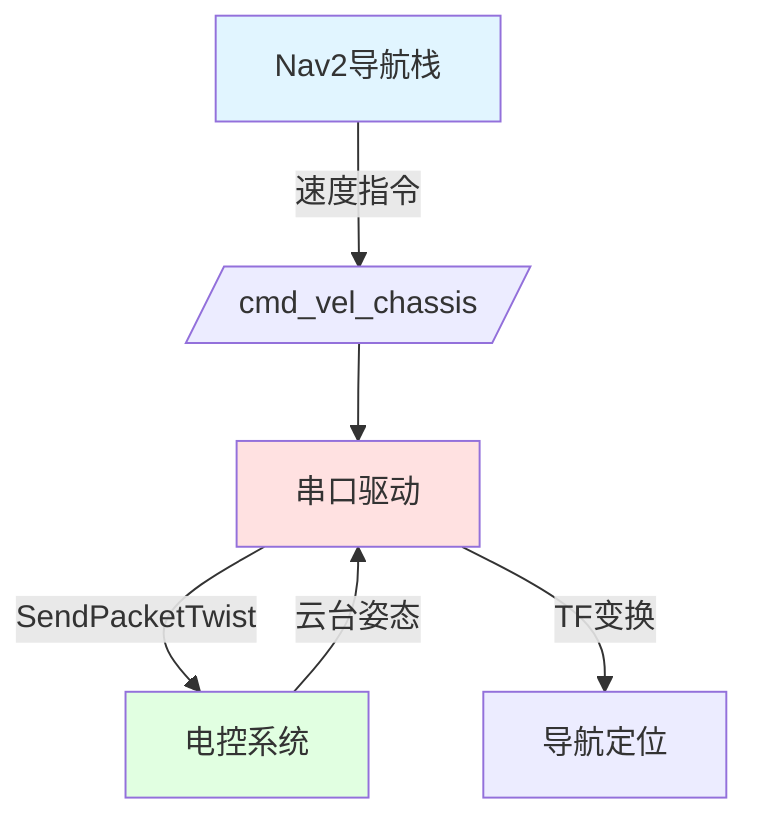

# Serial Driver

基于 ROS2 实现的串口通信驱动，用于上位机与电控系统的双向通讯，重点支持导航速度控制。

## 核心功能

- **速度控制**：接收Nav2导航栈的速度指令，通过串口发送到电控系统
- **位置反馈**：接收电控系统的云台姿态信息，发布TF变换用于导航定位
- **双向通信**：支持多种数据包类型的收发
- **异常处理**：自动重连机制，确保通讯稳定性

## 环境搭建与编译

### 安装依赖

```sh
rosdep install --from-paths src --ignore-src -r -y
sudo apt install ros-humble-serial-driver
```

### 克隆仓库

```sh
git clone https://github.com/Xiancaijiang/Serial_Driver.git
cd Serial_Driver
```

### 编译

```sh
colcon build --symlink-install
```

## 使用帮助

### 配置串口参数

编辑配置文件 [serial_driver.yaml](src/rm_serial_driver/config/serial_driver.yaml)：

```yaml
/rm_serial_driver:
  ros__parameters:
    device_name: /dev/ttyACM1    # 串口设备名称
    baud_rate: 115200            # 波特率
    flow_control: none           # 流控制
    parity: none                 # 校验位
    stop_bits: "1"               # 停止位
```

### 串口权限设置

```sh
sudo chmod 777 /dev/ttyACM0
```

### 启动串口模块

```sh
source install/setup.bash
ros2 launch rm_serial_driver serial_driver.launch.py
```

## 导航速度控制

本系统核心功能是实现Nav2导航栈与电控系统之间的速度控制通信。

### 工作原理

导航速度控制通过以下流程实现：

1. **Nav2导航**：Nav2导航栈生成速度控制指令
2. **速度指令发送**：通过`/cmd_vel_chassis`话题发送速度指令
3. **串口封装**：串口驱动订阅速度话题，封装为SendPacketTwist数据包
4. **电控通信**：通过串口将速度控制指令发送到电控系统
5. **位置反馈**：电控系统通过串口反馈云台姿态信息
6. **TF变换**：串口驱动发布odom到gimbal_link的TF变换，供导航定位使用

### 数据流

```
Nav2导航栈 → /cmd_vel_chassis → 串口驱动 → SendPacketTwist → 电控系统
电控系统 → 云台姿态 → 串口驱动 → TF变换 → 导航定位
```

### 系统架构图



### 使用示例

#### 1. 启动导航栈

```sh
source install/setup.bash
ros2 launch your_navigation_bringup navigation_bringup.launch.py
```

#### 2. 启动串口驱动

```sh
sudo chmod 777 /dev/ttyACM0
source install/setup.bash
ros2 launch rm_serial_driver serial_driver.launch.py
```

#### 3. 发送导航目标

通过Nav2的导航功能发送目标点，速度控制指令会自动通过串口发送到电控系统。

### ROS接口

#### 订阅的话题

| 话题名称 | 消息类型 | 描述 |
|:---|:---|:---|
| /cmd_vel_chassis | geometry_msgs::msg::Twist | 底盘速度控制指令 |

#### 发布的话题

| 话题名称 | 消息类型 | 描述 |
|:---|:---|:---|
| /latency | std_msgs::msg::Float64 | 数据传输延迟（毫秒） |

#### TF变换

- **odom → gimbal_link**：云台姿态变换，用于导航定位

### 注意事项

1. **Nav2依赖**：需要Nav2导航栈支持，确保已正确安装和配置Nav2
2. **坐标系**：确保所有节点使用统一的坐标系（通常为map坐标系）
3. **串口通信**：确保串口驱动正常工作，速度控制指令能够正确发送到电控系统
4. **话题名称**：确认Nav2发布的速度话题为`/cmd_vel_chassis`，或配置Nav2使用该话题名称

### 故障排除

#### 速度控制无响应

- 确认串口驱动已启动
- 检查`/cmd_vel_chassis`话题是否有数据：`ros2 topic echo /cmd_vel_chassis`
- 验证电控系统是否正常接收串口数据
- 检查SendPacketTwist数据包格式

#### 导航定位不准确

- 检查TF变换是否正常发布：`ros2 run tf2_tools view_frames`
- 确认电控系统发送的云台姿态数据正确
- 验证坐标系配置是否正确

## 通讯协议

### 数据包类型

| 数据包类型 | 头部标识 | 传输方向 | 功能描述 |
|:---|:---:|:---:|:---|
| ReceivePacketVision | 0x5A | 接收 | 接收云台姿态信息 |
| SendPacketTwist | 0xA4 | 发送 | 发送底盘速度控制指令 |

### SendPacketTwist (0xA4)

发送速度控制指令到电控系统，用于底盘运动控制。

**字段说明：**
- `linear_x, linear_y, linear_z`: 线速度分量，单位：米/秒
- `angular_x, angular_y, angular_z`: 角速度分量，单位：弧度/秒

**ROS话题：**
- 订阅：/cmd_vel_chassis (geometry_msgs::msg::Twist)

### ReceivePacketVision (0x5A)

接收云台姿态信息用于导航定位。

**字段说明：**
- `detect_color`: 机器人自身颜色（0-红色，1-蓝色）
- `reset_tracker`: 重置追踪器标志
- `roll, pitch, yaw`: 云台姿态角度，单位：弧度
- `aim_x, aim_y, aim_z`: 当前云台瞄准位置

**ROS话题：**
- TF变换：odom → gimbal_link

## 参数

| 参数名称 | 类型 | 默认值 | 描述 |
|:---|:---|:---|:---|
| device_name | string | - | 串口设备名称 |
| baud_rate | int | 115200 | 波特率 |
| flow_control | string | none | 流控制（none/hardware/software） |
| parity | string | none | 校验位（none/odd/even） |
| stop_bits | string | 1 | 停止位（1/1.5/2） |
| timestamp_offset | double | 0.0 | 时间戳偏移量（秒） |

## 依赖项

- `rclcpp`: ROS2 C++客户端库
- `rclcpp_components`: ROS2组件支持
- `serial_driver`: 串口驱动
- `geometry_msgs`: 几何消息类型
- `tf2_ros`: TF变换库
- `tf2_geometry_msgs`: TF几何消息

## 故障排除

### 串口连接失败

1. 检查串口设备名称是否正确
2. 确认串口权限设置：`sudo chmod 777 /dev/ttyACM0`
3. 检查波特率等参数是否匹配

### CRC校验错误

- 检查串口连接稳定性
- 确认数据包格式与电控端一致
- 检查通讯协议版本

## 许可证

MIT License

## 相关信息

详细的通讯协议说明请参考：[README (rm_serial_driver)](/src/rm_serial_driver/README.md)
